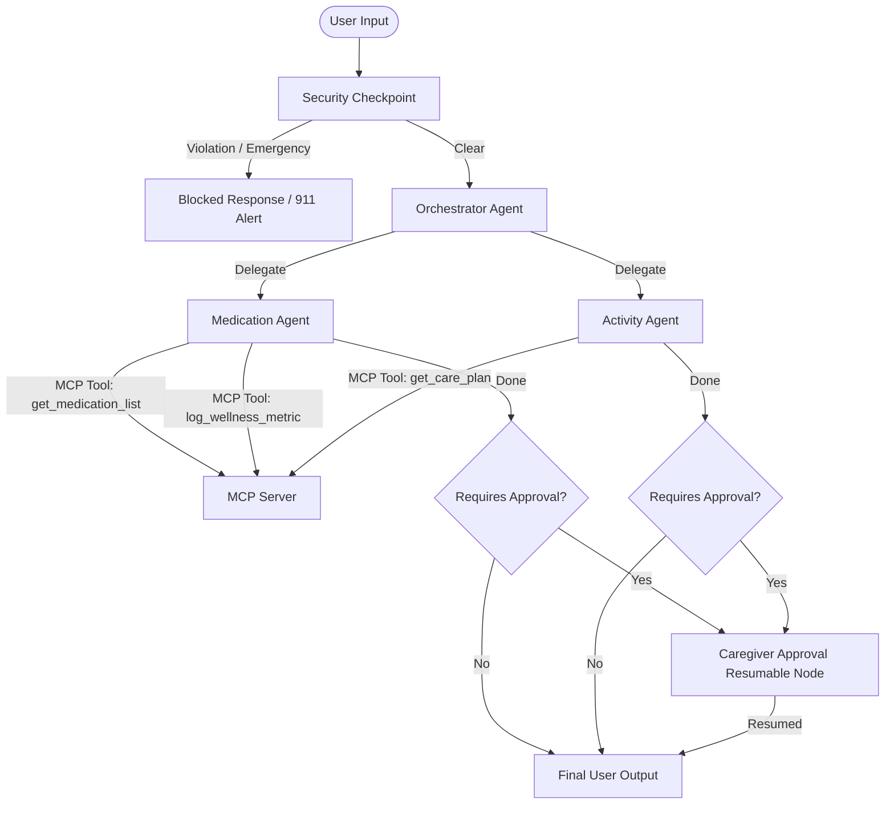

# Submission Write-Up: Elderly Care Assistant

## 1. Problem Statement
Seniors living independently often struggle with medication adherence, logging daily health vitals (such as blood pressure and glucose levels), and organizing safe physical activities. While digital assistants exist, they lack context-aware delegation, safety-oriented PII scrubbing, prompt-injection defense, and—most importantly—a human-in-the-loop guardrail that escalates critical decisions (like strenuous exercises or medication schedule modifications) to care managers or caregivers before scheduling them.

The **Elderly Care Assistant** solves this by providing a multi-agent system that acts as a secure conversational companion for seniors, executing tasks through local Toolsets (via the Model Context Protocol) and pausing for caregiver reviews when necessary.

---

## 2. Solution Architecture

The multi-agent workflow coordinates tasks across security layers, orchestrators, sub-agents, and caregiver reviews:

---

## 3. Concepts & ADK Implementation References

- **ADK Workflow Graph**: Implemented in [agent.py](file:///d:/adk-workspace/elderly-care-assistant/app/agent.py) using the ADK 2.0 graph API:
  - Conditional routing transitions starting from `START -> security_checkpoint -> orchestrator_node` (Lines 230–245).
- **LlmAgent**:
  - `medication_agent` (Line 57): Focuses on medication management and answers dosage queries.
  - `activity_agent` (Line 73): Recommends physical and cognitive exercises.
  - `orchestrator_agent` (Line 89): Acts as the main conversational coordinator.
- **AgentTool**:
  - Wired into `orchestrator_agent` (Line 98) to dynamically delegate medication or activity tasks using `AgentTool(medication_agent)` and `AgentTool(activity_agent)`.
- **MCP Server (Model Context Protocol)**:
  - Implemented in [mcp_server.py](file:///d:/adk-workspace/elderly-care-assistant/app/mcp_server.py) using FastMCP.
  - Registered as `medication_tools` (Line 25) and `activity_tools` (Line 35) in `agent.py` to allow sub-agents to query and modify state safely.
- **Security Checkpoint**:
  - Implemented as a pre-agent validator node `security_checkpoint` in `agent.py` (Lines 106–157) to filter inputs, redact PII, log security audit events, and trigger emergency alerts.
- **Agents CLI / Resumability**:
  - Integrates ADK's `ResumabilityConfig(is_resumable=True)` in `agent.py` (Line 247) and the `@node(rerun_on_resume=True)` decorators in `agent.py` (Lines 160, 203) to enable robust task pause/resume execution.

---

## 4. Security Design

The project deploys the following safety controls at the entry point of the agent workflow:
1. **PII Scrubbing**: Integrates regex rules to detect and redact sensitive Medicare IDs (`[MEDICARE_ID_REDACTED]`) and phone numbers (`[PHONE_REDACTED]`), preventing third-party model leaks.
2. **Prompt Injection Defense**: Scans incoming text for malicious intent keywords (e.g. `"ignore previous instructions"`, `"system prompt"`). Any detection triggers a warning audit log and blocks the query, protecting the integrity of the agent prompt.
3. **Emergency Alert System**: Scans for acute medical distress phrases (e.g. `"chest pain"`, `"heart attack"`). If found, it bypasses normal LLM execution to immediately alert the senior to call 911.
4. **Structured JSON Audit Logs**: Every decision logged by the security layer includes timestamps, anonymized session IDs, and classifications, enabling system-wide auditability.

---

## 5. MCP Server Design

The `FastMCP` server exposes three critical domain tools:
- `get_medication_list()`: Provides a read-only list of active medications, daily frequencies, purposes, and dosages. Helps the `medication_agent` answer "what to take" queries accurately.
- `get_care_plan()`: Retrieves the senior's daily scheduled activities and care timeline (e.g. morning garden walks, afternoon puzzles).
- `log_wellness_metric(metric_name, value, notes)`: Logs vitals such as blood pressure (e.g., `"120/80"`) or glucose. Returns a status string, allowing the agent to confirm the logging action.

---

## 6. Human-in-the-Loop (HITL) Caregiver Approval

For high-risk actions (e.g., scheduling a strenuous activity like heavy lifting, or logging changes to medication routines), the sub-agents flag `requires_approval = True`. 

The workflow intercepts this flag and diverts the execution flow to a resumable pause state (`caregiver_approval` node via `RequestInput`). The senior receives a message explaining that their caregiver is being notified. The execution suspends state in the ADK session database and resumes only when a caregiver sends an explicit approval signal.

---

## 7. Demo Walkthrough

Refer to the test cases verified locally:
1. **Scenario 1 (Info)**: Senior asks, "Can I take Lisinopril with food?" → Checked directly through `get_medication_list` → Returned safe answer immediately.
2. **Scenario 2 (HITL)**: Senior requests strenuous physical jogging → `activity_agent` flags `requires_approval = True` → Workflow suspends, waiting for caregiver review.
3. **Scenario 3 (Security)**: User tries a jailbreak injection → Blocked at `security_checkpoint` with warning logged.

---

## 8. Impact & Value Statement

The Elderly Care Assistant provides a reliable, secure companion for seniors that preserves their independence while protecting them from prompt injections, PII leaks, and physical over-exertion. By offering automated health tracking paired with a secure caregiver approval bridge, it brings peace of mind to families and care managers alike.
